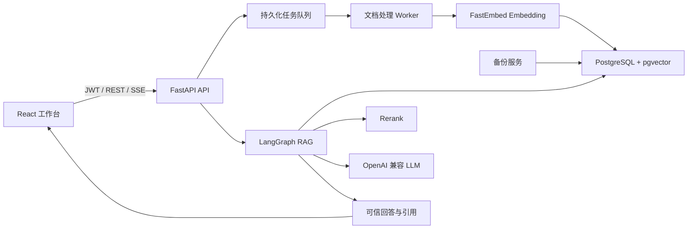

# 知境：企业 AI 创作知识库


面向企业资料问答与内容创作的 RAG 知识库系统。它将多格式文档解析、语义检索、Rerank、可信引用、流式问答和创作模板整合到一个可通过Docker Compose部署的工作台中。
当前定位是**企业试点版**：核心业务闭环、安全基础设施和持续质量门禁已经建立，适合接入真实资料持续评估；团队权限、OCR 和完整生产监控仍待建设。

## 核心能力

- 邮箱注册登录、JWT认证和用户数据隔离
- 知识库创建、修改、删除与文档管理
- PDF、DOCX、Markdown、TXT、CSV、HTML、PNG、JPEG、WebP批量上传
- 文档清洗、结构化切片、语义向量化与处理状态展示
- 扫描PDF OCR、PDF/DOCX/CSV表格提取和文档图片理解
- PostgreSQL + pgvector 语义检索、关键词评分与 Rerank
- LangGraph 编排检索、证据判断、回答、事实校验和引用组装
- 证据不足时拒答，回答附带来源文档、页码和相关摘要
- SSE流式回答、会话历史、会话切换与删除
- 产品卖点、营销文案、短视频脚本、Prompt 参考创作模板
- Alembic数据库迁移、持久化任务队列、失败重试与中断恢复
- 上传限制、速率限制、审计日志、密钥文件与数据库定时备份
- 多文档真实业务问答集和GitHub Actions自动质量门禁

## 系统架构



| 层级 | 技术 |
|---|---|
| 前端 | React 19、TypeScript、Vite、Nginx |
| 后端 | Python 3.11、FastAPI、SQLAlchemy、LangGraph |
| 数据与检索 | PostgreSQL 16、pgvector、FastEmbed、`BAAI/bge-small-zh-v1.5` |
| 文档解析 | PyMuPDF、python-docx、Python 标准库 |
| 部署与运维 | Docker Compose、Alembic、GitHub Actions |

## 快速启动

### 环境要求

- Docker Desktop 和 Docker Compose
- 可访问的 OpenAI 兼容 Chat Completions API

### 1. 配置环境变量

```powershell
Copy-Item backend/.env.example backend/.env
```

至少修改以下配置：

```dotenv
SECRET_KEY=请替换为随机且足够长的密钥
LLM_API_KEY=你的模型服务密钥
LLM_BASE_URL=https://你的模型服务地址
LLM_MODEL=你的模型名称
```

OCR 和图片理解使用 OpenAI 兼容视觉模型。默认复用 LLM 配置；如果主模型不支持图片，请单独配置 `VISION_API_KEY`、`VISION_BASE_URL` 和 `VISION_MODEL`。设置 `VISION_ENABLED=false` 可以关闭视觉调用，普通文本与表格解析仍会继续工作。

生产或共享环境建议将敏感值分别写入 `secrets/secret_key`、`secrets/llm_api_key` 和可选的 `secrets/rerank_api_key`。真实密钥和 `.env` 文件已被 Git 忽略。

### 2. 启动服务

```powershell
docker compose up --build -d
docker compose ps
```

服务地址：

- 前端工作台：<http://localhost:5173>
- Swagger API 文档：<http://localhost:8000/docs>
- 健康检查：<http://localhost:8000/health>

首次使用时注册账号、创建知识库并上传资料。文档状态变为“解析完成”后即可提问。

### 3. 常用运维命令

```powershell
# 查看后端和 worker 日志
docker compose logs -f backend worker

# 重建服务
docker compose up -d --build

# 停止服务，保留数据库卷
docker compose down
```

不要在需要保留数据时执行 `docker compose down -v`。

## 本地开发

### 后端与 Worker

```powershell
cd backend
python -m venv .venv
.\.venv\Scripts\Activate.ps1
pip install -e ".[dev]"
Copy-Item .env.example .env
uvicorn app.main:app --reload
```

另开终端启动文档处理 Worker：

```powershell
cd backend
.\.venv\Scripts\Activate.ps1
python -m app.worker
```

### 前端

```powershell
cd frontend
npm install
npm run dev
```

## RAG 问答流程

```text
候选检索
  -> 混合评分与 Rerank
  -> 高置信证据去重
  -> 证据充足度判断
  -> 回答或拒答
  -> 事实与数字校验
  -> 引用组装
```

切片保存章节标题、页码和文本范围等元数据。最终引用只保留参与回答的证据，并展示命中位置附近的相关文本，而不是固定截取文档开头。

修改 Embedding 模型、向量维度或切片策略后，需要重新解析已有文档。

## API 概览

所有业务接口均位于 `/api` 下：

| 模块 | 主要接口 |
|---|---|
| 认证 | `POST /auth/register`、`POST /auth/login` |
| 知识库 | `GET/POST /knowledge-bases`、`PUT/DELETE /knowledge-bases/{id}` |
| 文档 | `GET /documents`、`POST /documents/upload`、`POST /documents/{id}/reprocess` |
| 问答 | `POST /chat/ask`、`POST /chat/ask/stream` |
| 历史 | `GET /chat/sessions`、`GET/DELETE /chat/sessions/{id}` |
| 审计 | `GET /audit-logs` |

完整请求和响应模型请查看启动后的 Swagger 文档。

## 质量门禁

自动门禁在每次 push 和 pull request 时运行后端测试、Ruff 和前端生产构建：

```powershell
.\scripts\quality-gate.ps1 -SkipLiveEvaluation
```

完整 RAG 门禁会创建隔离知识库、上传目录中的全部支持格式文档，并连续运行三轮真实业务问答集：

```powershell
.\scripts\quality-gate.ps1 `
  -DocumentsDir "C:\path\to\knowledge-base-documents"
```

阶段验收阈值：

| 指标 | 门槛 |
|---|---:|
| 检索命中率最低值 | ≥ 90% |
| 引用准确率最低值 | ≥ 80% |
| 回答忠实度最低值 | ≥ 80% |
| 平均回答延迟最高值 | ≤ 15 秒 |
| 不可回答问题 | 必须拒答，不得编造 |

当前多文档业务集包含 20 道订单、支付、物流、退换货和产品资料问题，并覆盖同义问法、跨文档问题、干扰问题与不可回答问题。最近一次单轮诊断结果为检索命中率 `90%`、引用准确率 `88.89%`、回答忠实度 `75.10%`、平均延迟 `12.56 秒`；忠实度尚未达到正式三轮门禁要求，需继续优化后再作为阶段验收结果。OCR、表格和图片资料接入后，应继续补充对应问答案例。

## 数据库迁移与备份

应用和 Worker 启动时会自动执行 Alembic 升级，也可以手动运行：

```powershell
cd backend
.\.venv\Scripts\alembic.exe current
.\.venv\Scripts\alembic.exe upgrade head
```

`backup` 服务启动后立即创建 PostgreSQL 压缩备份，之后按配置周期运行。备份位于被 Git 忽略的 `backups/` 目录。恢复方式、限流配置和密钥文件说明见 [运维文档](docs/OPERATIONS.md)。

## 项目结构

```text
enterprise-ai-kb/
├─ backend/
│  ├─ alembic/                 # 数据库迁移
│  ├─ app/
│  │  ├─ core/                 # 配置、数据库与认证
│  │  ├─ routers/              # REST 与 SSE API
│  │  ├─ services/             # 文档、RAG、任务、安全与审计
│  │  └─ worker.py             # 文档任务 Worker
│  ├─ evaluation/              # 数据集、评估器与本地报告
│  └─ tests/
├─ frontend/                   # React 工作台
├─ docs/                       # 运维文档
├─ scripts/                    # 质量门禁脚本
├─ secrets/                    # 本地密钥说明，真实密钥不入库
├─ docker-compose.yml
└─ README.md
```

## 当前边界

- 当前为用户级数据隔离，尚无组织、部门、角色和共享权限。
- OCR 和图片理解依赖外部视觉模型，准确率、延迟和费用取决于模型服务；复杂跨页表格仍需人工抽检。
- 文档 Worker 当前按单任务串行处理，大规模并发需要进一步扩展。
- 审计日志已有查询 API，尚未提供独立管理后台和完整生产监控告警。
- 模型生成仍可能存在误差，重要结论应结合引用资料人工核验。

## 后续目标

1. 持续扩展真实业务文档和问答集，使三轮质量门禁稳定达标。
2. 扩展跨页表格重建、图表数值校验和多模态质量评估集。
3. 根据试点反馈选择团队协作权限或高级 Agent 创作作为下一阶段主线。
