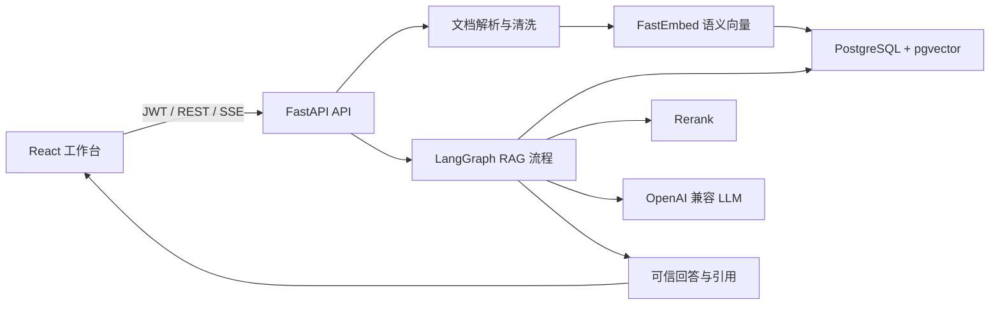

# 知境：企业 AI 创作知识库


面向企业资料问答与内容创作的单用户知识库系统。项目已完成“功能完整 MVP”和第二阶段 RAG 质量冲刺，目前适合进行小范围企业试点，重点能力包括结构化文档解析、语义检索、Rerank、可信引用、拒答、会话历史、流式回答和知识库增强创作。

## 当前阶段

**阶段定位：企业试点版，尚非生产正式版。**

当前系统已经形成完整使用闭环：

1. 用户注册并登录。
2. 创建个人知识库，上传 PDF、Markdown 或 TXT。
3. 系统自动清洗、结构化切片并生成语义向量。
4. 用户通过智能问答或创作模板发起任务。
5. LangGraph 执行检索、Rerank、证据判断、回答、事实校验和引用组装。
6. 前端以 SSE 流式展示回答，并保存会话历史。

第二阶段已重点提升检索、引用和回答忠实度。基于华为公开资料企业问答集连续运行 3 轮，当前验收结果为：

| 指标 | 平均值 | 最低值 / 最高延迟 | 阶段目标 |
|---|---:|---:|---:|
| 检索命中率 | 95.8% | 最低 93.8% | 最低不低于 90% |
| 引用准确率 | 100.0% | 最低 100.0% | 最低不低于 80% |
| 回答忠实度 | 89.1% | 最低 86.5% | 最低不低于 80% |
| 平均回答延迟 | 7.16 秒 | 最高 7.62 秒 | 不高于 15 秒 |

详细报告见 [RAG 三轮验收报告](backend/evaluation/reports/rag-eval-20260613-235150.md)。

## 已实现功能

### 账号与数据隔离

- 邮箱注册、JWT 登录和密码哈希存储
- 用户级知识库、文档和问答会话隔离
- 知识库创建、修改和删除

### 文档管理

- PDF、Markdown、TXT 上传
- 文档解析状态、失败原因、重新解析和删除
- 自动移除重复页眉、页脚、页码和目录型噪声
- 按标题、段落和列表进行结构化切片
- 保存页码、章节标题、字符范围等切片元数据
- 新文档上传后自动完成清洗、切片和向量化

### RAG 问答

- `BAAI/bge-small-zh-v1.5` 中文语义 Embedding
- PostgreSQL + pgvector 向量存储与近邻候选检索
- 语义相似度、关键词命中、章节相关性和噪声惩罚混合评分
- 可选外部 Rerank，默认使用 LLM Rerank
- 高置信证据筛选、重复证据去除和相关摘要截取
- 证据不足时拒绝编造答案
- 回答事实与数字校验，失败后自动重试一次
- 回答引用来源、页码、相关摘要和相关度
- 最近会话上下文参与回答
- 普通 JSON 问答接口和 SSE 流式回答接口

### 工作台与创作

- React 单页中文工作台
- 智能问答、资料引用侧栏和文档管理
- 问答历史列表、会话切换和删除
- 产品卖点、营销文案、短视频脚本、Prompt 参考四类创作模板
- 创作结果逐字展示并附带知识库引用

### 质量保障

- 文档清洗、结构化切片、引用去重、证据阈值和拒答单元测试
- LangGraph 流程、SSE、会话历史和基础业务集成测试
- 标准企业问答集连续 3 轮评估
- 检索命中率、引用准确率、回答忠实度和延迟质量门禁
- 每次问答记录候选、最终证据、阶段耗时、校验状态和拒答原因

## 技术架构



### 核心技术

- 前端：React 19、TypeScript、Vite、Nginx
- 后端：Python 3.11、FastAPI、SQLAlchemy、LangGraph
- 数据库：PostgreSQL 16、pgvector
- 文档解析：PyMuPDF
- Embedding：FastEmbed、`BAAI/bge-small-zh-v1.5`
- 模型接口：OpenAI 兼容 Chat Completions API
- 部署：Docker Compose

### LangGraph 问答流程

```text
检索候选
  -> Rerank 与证据去重
  -> 证据充足度判断
  -> 生成回答或拒答
  -> 事实与数字校验
  -> 引用组装
```

## 快速启动

### 环境要求

- Docker Desktop 与 Docker Compose
- 可访问的 OpenAI 兼容模型 API

### 1. 创建环境文件

```powershell
Copy-Item backend/.env.example backend/.env
```

编辑 `backend/.env`，至少修改：

```dotenv
SECRET_KEY=请替换为随机且足够长的密钥
LLM_API_KEY=你的模型服务密钥
LLM_BASE_URL=https://你的模型服务地址
LLM_MODEL=你的模型名称
```

不要将真实密钥提交到版本库或写入 README。

### 2. 启动全部服务

```powershell
docker compose up --build -d
docker compose ps
```

### 3. 访问系统

- 前端工作台：<http://localhost:5173>
- API 文档：<http://localhost:8000/docs>
- 健康检查：<http://localhost:8000/health>

首次使用时在登录页创建账号，然后创建知识库并上传资料。文档状态变为“解析完成”后即可提问。

### 常用 Docker 命令

```powershell
# 查看日志
docker compose logs -f backend

# 重新构建后端
docker compose up -d --build backend

# 停止服务
docker compose down

# 停止并删除数据库数据卷，操作不可恢复
docker compose down -v
```

## 本地开发

### 后端

本地开发默认可使用 SQLite；Docker Compose 会覆盖为 PostgreSQL + pgvector。

```powershell
cd backend
python -m venv .venv
.\.venv\Scripts\Activate.ps1
pip install -e ".[dev]"
Copy-Item .env.example .env
uvicorn app.main:app --reload
```

### 前端

```powershell
cd frontend
npm install
npm run dev
```

Vite 开发服务器会将 `/api` 和 `/health` 请求代理到后端。

## 配置说明

主要配置位于 `backend/.env`：

| 配置项 | 默认值 | 作用 |
|---|---|---|
| `DATABASE_URL` | SQLite 本地文件 | 数据库连接；Docker 中自动覆盖为 PostgreSQL |
| `SECRET_KEY` | 开发占位值 | JWT 签名密钥，部署前必须替换 |
| `LLM_BASE_URL` | OpenAI API | OpenAI 兼容模型服务地址 |
| `LLM_MODEL` | `gpt-4.1-mini` | 回答、校验及默认 LLM Rerank 使用的模型 |
| `EMBEDDING_MODEL` | `BAAI/bge-small-zh-v1.5` | 语义向量模型 |
| `RETRIEVAL_TOP_K` | `8` | 混合评分后保留的检索候选数 |
| `RERANK_TOP_K` | `3` | Rerank 后最多保留的最终证据数 |
| `EVIDENCE_MIN_SCORE` | `0.38` | 最低证据综合分数 |
| `CHUNK_SIZE` | `700` | 结构化切片目标长度 |
| `CHUNK_OVERLAP` | `100` | 相邻切片上下文重叠长度 |
| `CHAT_HISTORY_MESSAGES` | `8` | 加入 RAG 提示词的最近消息数量 |
| `RERANK_PROVIDER` | `llm` | Rerank 方式；也可配置外部 Rerank API |

修改 Embedding 模型、向量维度或切片策略后，应重新解析已有文档。

## API 概览

所有业务接口均位于 `/api` 下：

| 模块 | 主要接口 |
|---|---|
| 认证 | `POST /auth/register`、`POST /auth/login` |
| 知识库 | `GET/POST /knowledge-bases`、`PUT/DELETE /knowledge-bases/{id}` |
| 文档 | `GET /documents`、`POST /documents/upload`、`POST /documents/{id}/reprocess` |
| 问答 | `POST /chat/ask`、`POST /chat/ask/stream` |
| 历史 | `GET /chat/sessions`、`GET/DELETE /chat/sessions/{id}` |

完整请求结构与响应模型请查看启动后的 Swagger 文档。

## 测试与验收

### 自动化测试

```powershell
cd backend
.\.venv\Scripts\python.exe -m pytest
.\.venv\Scripts\ruff.exe check .

cd ..\frontend
npm run build
```

当前完整后端测试结果为 **18 passed**。

### 企业问答集评估

首次运行时，评估脚本会创建隔离账号和知识库、上传指定文档，并输出 JSON 与 Markdown 报告：

```powershell
.\backend\.venv\Scripts\python.exe -m evaluation.evaluate `
  --document "C:\path\to\企业测试文档.pdf" `
  --fail-under
```

重复评估已有知识库：

```powershell
.\backend\.venv\Scripts\python.exe -m evaluation.evaluate `
  --email "your-eval@example.com" `
  --password "your-password" `
  --knowledge-base-id 1 `
  --fail-under
```

默认连续执行 3 轮。任一核心指标最低值未达标，或最高平均延迟超过 15 秒，`--fail-under` 将返回失败退出码。

## 项目结构

```text
enterprise-ai-kb/
├─ backend/
│  ├─ app/
│  │  ├─ core/                 # 配置、数据库与认证
│  │  ├─ routers/              # HTTP 与 SSE API
│  │  ├─ services/
│  │  │  ├─ documents.py       # 清洗、结构化切片与向量化
│  │  │  └─ rag.py             # 检索、Rerank、LangGraph 与引用
│  │  ├─ models.py
│  │  ├─ schemas.py
│  │  └─ main.py
│  ├─ evaluation/              # 企业问答集、评估脚本与报告
│  ├─ initdb/                  # PostgreSQL 初始化
│  └─ tests/
├─ frontend/
│  └─ src/                     # React 工作台
├─ data/                       # 本地数据
├─ docker-compose.yml
├─ Makefile
└─ README.md
```

## 当前边界

- 当前是单用户知识库模型，没有组织、部门、角色与共享权限。
- PDF 仅处理可提取文本，尚未实现扫描件 OCR、表格结构恢复和图片理解。
- 文档解析使用 FastAPI 后台任务，服务重启后不会自动恢复中断任务。
- 数据库结构通过启动时增量检查维护，尚未引入 Alembic 正式迁移体系。
- 尚未实现限流、审计后台、内容审核、密钥托管、备份恢复和完整生产监控。
- 评估集当前基于一份企业测试文档，扩大文档类型和业务场景后仍需持续回归。
- 模型生成内容仍可能存在误差，重要结论必须结合引用资料人工核验。

## 后续开发目标

建议下一阶段优先完成企业试点所需的工程化能力：

1. 引入 Alembic、任务队列和失败任务自动恢复。
2. 增加上传限制、速率限制、审计日志、密钥管理和数据库备份。
3. 扩展多文档、多格式和真实业务问答集，持续运行质量门禁。
4. 增加 OCR、表格解析和图片理解能力。
5. 根据试点反馈，再选择团队协作权限或高级 Agent 创作作为主线。
